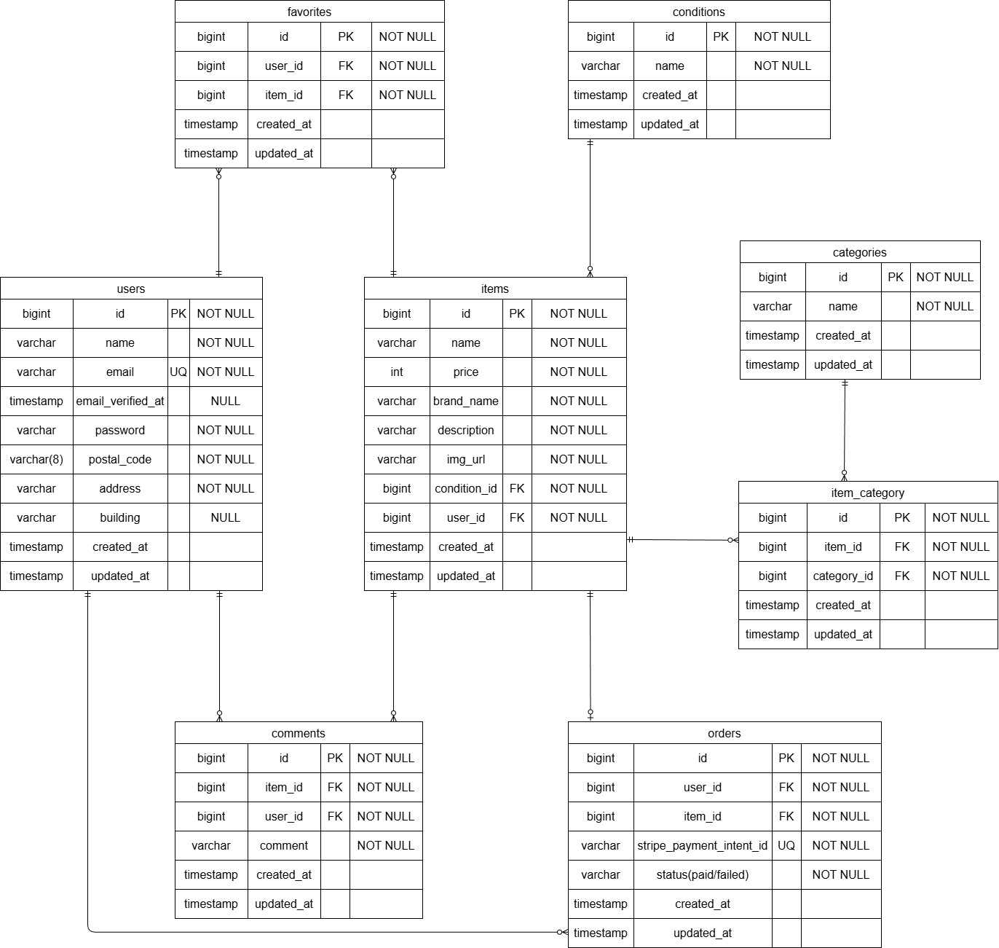

環境構築

## Dockerビルド

・git clone git@github.com:shinichi-ushioda/coachtech-furima.git
・docker-compose up -d --build

## Laravel環境構築

・docker-compose exec php bash
・composer install
・cp .env.example .env , 環境変数を適宜変更
・php artisan key:generate
・php artisan migrate
・php artisan db:seed

## 開発環境

・商品一覧画面：http://localhost/
・ユーザー登録：http://localhost/register
・phpMyAdimin：http://localhost:8080/

## 仕様技術（実行環境）
・PHP8.5.0
・Laravel 8.83.8
・jquery 3.7.1.min.js
・MySQL 8.0.26
・nginX 1.21.1

## ER図

## テストユーザー情報

### ユーザー1
- Name: 山田太郎
- Email: taro@example.com
- Password: taro_pass123

### ユーザー2
- Name: 佐藤花子
- Email: hanako@example.com
- Password: hanako_pass456

### ユーザー3
- Name: 鈴木一郎
- Email: ichiro@example.com
- Password: ichiro_pass789

※上記ユーザーは `UsersTableSeeder` により自動生成される。

##　バリデーション

・要件シートには記載がないが、メールアドレスが重複しないようにバリデーションを実装している。
  'email.unique' => 'このメールアドレスは既に使用されています',
