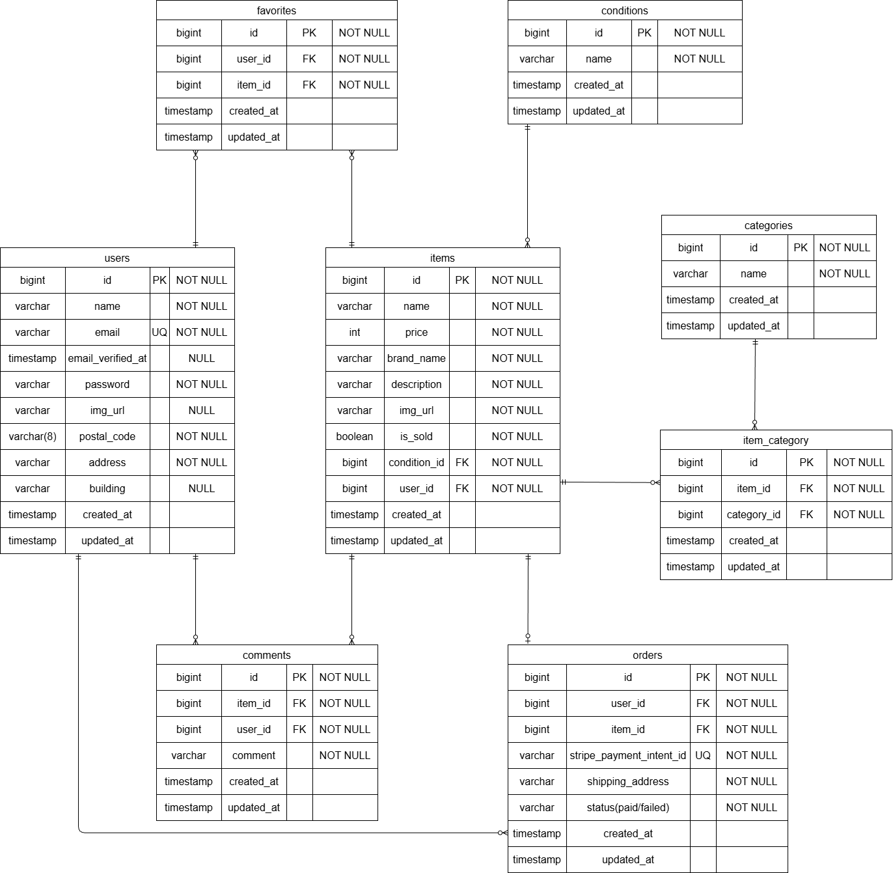

環境構築

## Dockerビルド

・git clone git@github.com:shinichi-ushioda/coachtech-furima.git
・docker-compose up -d --build

## Laravel環境構築

・docker-compose exec php bash  
・composer install  
・cp .env.example .env , 環境変数を適宜変更  
・php artisan key:generate  
・php artisan migrate  
・php artisan db:seed  
### .envの確認(以下の通りにする)
DB_CONNECTION=mysql  
DB_HOST=mysql  
DB_PORT=3306  
DB_DATABASE=furima_db  
DB_USERNAME=laravel_user  
DB_PASSWORD=laravel_pass  

## 開発環境

・商品一覧画面：http://localhost/  
・ユーザー登録：http://localhost/register  
・phpMyAdimin：http://localhost:8080/  
・mailhog:http://localhost:8025/  

## 仕様技術（実行環境）
・PHP8.5.0  
・Laravel 8.83.8  
・jquery 3.7.1.min.js  
・MySQL 8.0.26  
・nginX 1.21.1

## ER図



itemsテーブルのis_soldカラムは、0= 販売中, 1= 売り切れ  

## テストユーザー情報

### ユーザー1
- Name: 山田太郎
- Email: taro@example.com
- Password: taro_pass123
- 出品商品：腕時計,革靴,コーヒーミル  
### ユーザー2
- Name: 佐藤花子
- Email: hanako@example.com
- Password: hanako_pass456
- 出品商品：玉ねぎ3束,ショルダーバッグ,メイクセット  
### ユーザー3
- Name: 鈴木一郎
- Email: ichiro@example.com
- Password: ichiro_pass789
- 出品商品：HDD,ノートPC,マイク,タンブラー  
※上記ユーザーは `UsersTableSeeder` により自動生成される。
 


## メール認証機能（MailHog）の確認手順
本プロジェクトでは、開発環境でのメール送受信テストに **MailHog** を使用している。
メール認証機能をテストする際は、以下の手順で MailHog を起動し、メールを確認してください。
### 0.docker-compose.ymlの確認  
以下の記述がない場合は追記する。  
mailhog:  
    image: mailhog/mailhog  
    container_name: mailhog  
    ports:  
     - "1025:1025"  
      - "8025:8025"  


### 1. 開発環境の起動
プロジェクトのルートディレクトリで以下のコマンドを実行し、Mailhog を含むすべてのコンテナを起動します。
```bash
docker compose up -d
```

### 2. メール受信箱（MailHog WEB画面）へのアクセス
ブラウザで以下のURLを開くと、MailHog のダッシュボード（受信トレイ）が表示されます。
* **URL:** `http://localhost:8025`

### 3. メール認証のテスト手順
1. アプリケーションの新規登録画面（`/register`）からユーザー登録を行います。
2. 登録が成功すると、自動的に「メール認証誘導画面」へ遷移します。
3. 画面内の「認証はこちらから」ボタンをクリックすると、上記の MailHog 画面が開きます。
4. MailHog の受信トレイに届いている最新の認証メールを開き、「Verify Email Address」リンクをクリックします。
5. アプリケーション側の画面が、自動的に「プロフィール設定画面（`/mypage/profile`）」へ遷移すれば認証完了です。  

## stripe決済機能について

### 1.環境変数の設定(.env)
STRIPE_KEY=pk_test_...(あなたの公開鍵)  
STRIPE_SECRET=sk_test_...(あなたの秘密鍵) 

### 2.　決済のテスト手順  

#### ■事前準備
1. `docker-compose exec php bash` でコンテナ内に入ります。
2. `composer install` を実行し、Stripeの依存パッケージ（`stripe/stripe-php`）がインストールされていることを確認します。  

#### ■カード支払い
**カード番号**：4242 4242 4242 4242  
**有効期限**：現在より未来の日付で任意の数字（例：12/30）
**CVC(セキュリティコード)**：任意の3桁の数字(例：123)  

#### ■ 成功の確認
決済が成功すると、商品詳細画面またはマイページ等で対象商品のステータスが「SOLD」に更新されます。  

## テストの実行方法

本プロジェクトでは、PHPUnitを使用した自動テストを導入しています。テストを実行する際は、以下の手順に従ってください。

### 1. テストの実行コマンド
アプリケーションのルートディレクトリ（`~/src` 内）にて、環境に合わせて以下のコマンドを実行します。

```bash
# 通常の Docker 環境の場合
php artisan test

# 権限エラー（Permission denied）が発生する場合
sudo php artisan test
```

### 2. 実行結果の確認
コマンド実行後、ターミナル上に **「PASS」** と緑色の文字で表示されれば、すべてのテストが正常に通過しています。

## その他  
・要件シートには記載がないが、自分で出品した商品をマイページから購入できないよう、購入ボタンをグレー色に変更し、「購入手続きへ（自分が出品した商品です）」と表示されるように実装している。  
・要件シートには記載がないが、メールアドレスが重複しないようにバリデーションを実装している。  
  'email.unique' => 'このメールアドレスは既に使用されています',